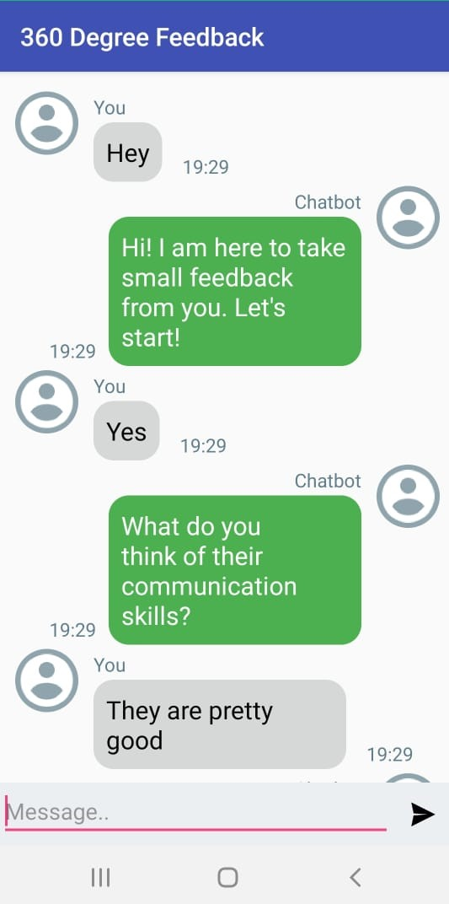
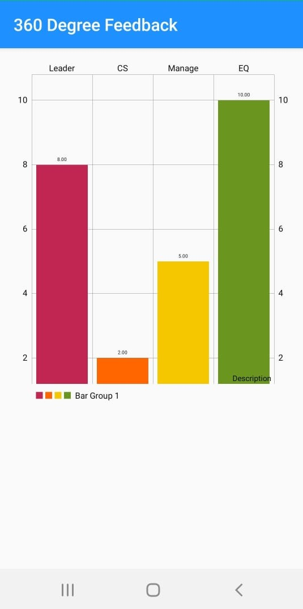

# 360-Degree-Feedback-Analysis-System

## Main idea behind this project : 

Due to the transformation from an industrial age to knowledge era, performance evaluation in organizations has been considered as 
one of the most important issues. Organization being geographically diffused, evaluating the performance of the employees working 
in it is a major challenge. 

The idea proposed in this system is to perform an analysis considering a number of performance measures for the derivation of performance
prediction indicators needed for employee performance assessment, monitoring and evaluation using sentiment analysis. 
The aim is to predict the quality, productivity and potentiality of the employees across various disciplines through an unbiased system 
which will enable higher-level authorities to take decisions and understand certain patterns of employee motivation, satisfaction, 
growth and decline in any organization. 

## I have published paper on this concept in International Advanced Research Journal in Science, Engineering and Technology (IARJSET) :
https://iarjset.com/wp-content/uploads/2019/11/IARJSET.2019.61006.pdf 

## Technologies, Database and Tools used :
Android Studio, Java, Python, XML, DialogFlow, Firebase (NoSql Database)

## Files in this repository are the highlights of the project focusing on :
1. Chatbot integration 
2. Feedback Analysis using Sentiment Analysis
3. Employee performance report generation

  
